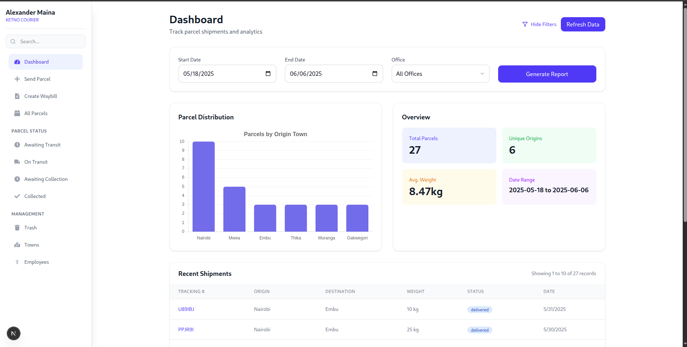

# Kukena Courier Dashboard

Kukena Courier Dashboard is a comprehensive courier and parcel management web application built with [Next.js](https://nextjs.org). The platform is designed to streamline the management of parcels, waybills, employees, and shipments for courier businesses, offering an intuitive dashboard with advanced analytics and operational controls.

## Features

- **Parcel Management**: Track, filter, and update parcel statuses (Registered, In Transit, Delivered, Collected) with detailed recipient/sender information.
- **Waybill Management**: Generate, update, and review waybills for all shipments.
- **Employee Management**: Add, update, and manage courier employees, including their roles and statuses.
- **Analytics Dashboard**: Visualize parcel distribution by origin location, monitor total parcels, unique origins, and average weights via dynamic charts.
- **Filtering and Reporting**: Filter parcels by date, status, or town; generate and export reports.
- **Authentication**: Secure login and protected routes using JWT-based authentication.
- **Pagination and Search**: Efficient browsing of large datasets with paginated views and quick search features.
- **Responsive UI**: Modern and responsive user interface designed with accessibility and usability in mind.

## Tech Stack

- **Frontend**: Next.js (React), TypeScript
- **UI Components**: Tailwind CSS, React Icons, Custom UI Kit
- **State Management**: React Context, Hooks
- **Data Visualization**: Chart.js (via react-chartjs-2)
- **Authentication**: JWT-based, with protected client routes
- **API**: Connects to a RESTful backend (API URL configurable via `NEXT_PUBLIC_API_BASE_URL`)

## Getting Started

First, install dependencies and run the development server:

```bash
npm install
npm run dev
# or
yarn install
yarn dev
# or
pnpm install
pnpm dev
# or
bun install
bun dev
```

Open [http://localhost:3000](http://localhost:3000) in your browser to use the dashboard.

### Environment Variables

Create a `.env.local` with the following:
```
NEXT_PUBLIC_API_BASE_URL=https://your-api-endpoint.com
```

## Project Structure

- `app/` - Next.js app directory containing all routes and pages
  - `page.tsx` - Main dashboard displaying analytics
  - `parcels/` - Parcel listings, status updates, and details
  - `waybill/` - Waybill management and creation
  - `employees/` - Employee management and admin features
  - `components/` - Reusable React components (Sidebar, Layout, UI Kit, etc.)
  - `context/` - React Contexts for authentication, towns, etc.

## Key Screenshots

<div style="display: flex; flex-wrap: wrap; gap: 16px;">
  

</div>

## Learn More

- [Next.js Documentation](https://nextjs.org/docs) - Learn about Next.js features and API.
- [Learn Next.js](https://nextjs.org/learn) - Interactive Next.js tutorial.

## Deploy

The easiest way to deploy your Next.js app is via [Vercel](https://vercel.com/new?utm_medium=default-template&filter=next.js&utm_source=create-next-app&utm_campaign=create-next-app-readme).

See [Next.js deployment docs](https://nextjs.org/docs/app/building-your-application/deploying) for more info.

---

**Kukena Courier Dashboard** helps you manage parcels, waybills, and operational logistics efficiently and securely.
